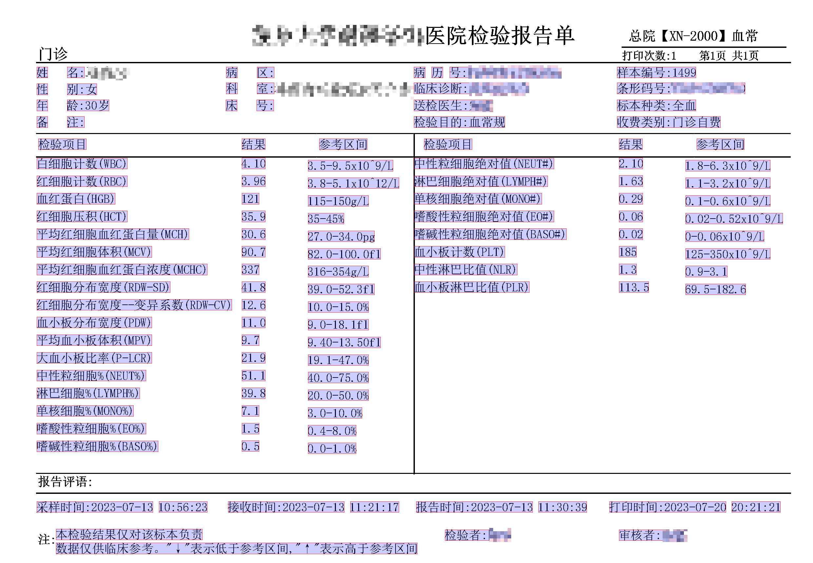

# Hemogram_report_extraction
>  使用[pdfplumber](https://github.com/jsvine/pdfplumber)把医院检验报告单PDF批量转Excel



```
PDF_dicts = []

for PDF_file in PDF_files:
  Name = re.search(r'[^\\]+(?=\.pdf)', PDF_file).group() 

  # 提取PDF信息

  pdf = pdfplumber.open(PDF_file)
  page = pdf.pages[0]
  text = page.extract_text()

  Collection_date = re.findall(r'采样时间:(\d+-\d+-\d+)', text)[0]

  WBC = re.findall(r'白细胞计数\(WBC\) (\d+\.\d+)', text)[0]
  RBC = re.findall(r'红细胞计数\(RBC\) (\d+\.\d+)', text)[0]
  HGB = re.findall(r'血红蛋白\(HGB\) (\d+)', text)[0]
  HCT = re.findall(r'红细胞压积\(HCT\) (\d+\.\d+)', text)[0]
  MCH = re.findall(r'平均红细胞血红蛋白量\(MCH\) (\d+\.\d+)', text)[0]
  MCV = re.findall(r'平均红细胞体积\(MCV\) (\d+\.\d+)', text)[0]
  MCHC = re.findall(r'平均红细胞血红蛋白浓度\(MCHC\) (\d+)', text)[0]
  RDW_SD = re.findall(r'红细胞分布宽度\(RDW-SD\) (\d+\.\d+)', text)[0]
  RDW_CV = re.findall(r'红细胞分布宽度--变异系数\(RDW-CV\) (\d+\.\d+)', text)[0]
  PDW = re.findall(r'血小板分布宽度\(PDW\) (\d+\.\d+)', text)[0]
  MPV = re.findall(r'平均血小板体积\(MPV\) (\d+\.\d+)', text)[0]
  P_LCR = re.findall(r'大血小板比率\(P-LCR\) (\d+\.\d+)', text)[0]
  NEUT_percent = re.findall(r'中性粒细胞%\(NEUT%\) (\d+\.\d+)', text)[0]
  LYMPH_percent = re.findall(r'淋巴细胞%\(LYMPH%\) (\d+\.\d+)', text)[0]
  MONO_percent = re.findall(r'单核细胞%\(MONO%\) (\d+\.\d+)', text)[0]
  EO_percent = re.findall(r'嗜酸性粒细胞%\(EO%\) (\d+\.\d+)', text)[0]
  BASO_percent = re.findall(r'嗜碱性粒细胞%\(BASO%\) (\d+\.\d+)', text)[0]
  NEUT_absolute = re.findall(r'中性粒细胞绝对值\(NEUT#\) (\d+\.\d+)', text)[0]
  LYMPH_absolute = re.findall(r'淋巴细胞绝对值\(LYMPH#\) (\d+\.\d+)', text)[0]
  MONO_absolute = re.findall(r'单核细胞绝对值\(MONO#\) (\d+\.\d+)', text)[0]
  EO_absolute = re.findall(r'嗜酸性粒细胞绝对值\(EO#\) (\d+\.\d+)', text)[0]
  BASO_absolute = re.findall(r'嗜碱性粒细胞绝对值\(BASO#\) (\d+\.\d+)', text)[0]
  PLT = re.findall(r'血小板计数\(PLT\) (\d+)', text)[0]
  NLR = re.findall(r'中性淋巴比值\(NLR\) (\d+\.\d+)', text)[0]
  PLR = re.findall(r'血小板淋巴比值\(PLR\) (\d+\.\d+)', text)[0]
  
  PDF_dicts.append({'Name': Name, 'Collection_date': Collection_date, 'File': PDF_file, 'WBC': WBC, 'RBC': RBC, 'HGB': HGB, 'HCT': HCT, 'MCH': MCH, 'MCV': MCV, 'MCHC': MCHC, 'RDW_SD': RDW_SD, 'RDW_CV': RDW_CV, 'PDW': PDW, 'MPV': MPV, 'P_LCR': P_LCR, 'NEUT%': NEUT_percent, 'LYMPH%': LYMPH_percent, 'MONO%': MONO_percent, 'EO%': EO_percent, 'BASO%': BASO_percent, 'NEUT#': NEUT_absolute, 'LYMPH#': LYMPH_absolute, 'MONO#': MONO_absolute, 'EO#': EO_absolute, 'BASO#': BASO_absolute, 'PLT': PLT, 'NLR': NLR, 'PLR': PLR})

PDF_dicts
```

# 结果

| Name   | Collection_date | File                                                         | WBC  | RBC  | HGB  | HCT  | MCH  | MCV  | MCHC | RDW_SD | RDW_CV | PDW  | MPV  | P_LCR | NEUT% | LYMPH% | MONO% | EO%  | BASO% | NEUT# | LYMPH# | MONO# | EO#  | BASO# | PLT  | NLR  | PLR   |
| ------ | --------------- | ------------------------------------------------------------ | ---- | ---- | ---- | ---- | ---- | ---- | ---- | ------ | ------ | ---- | ---- | ----- | ----- | ------ | ----- | ---- | ----- | ----- | ------ | ----- | ---- | ----- | ---- | ---- | ----- |
| 佚名A  | 2023-09-14      | c:\Users\cpres\Documents\GitHub\Hemogram_report_extraction\Sample_data\佚名A.pdf | 6.03 | 4.92 | 114  | 36.9 | 23.2 | 75.0 | 309  | 41.2   | 15.1   | 10.2 | 9.4  | 20.8  | 67.7  | 23.4   | 7.1   | 1.5  | 0.3   | 4.08  | 1.41   | 0.43  | 0.09 | 0.02  | 257  | 2.9  | 182.3 |
| 匿名B  | 2023-07-13      | c:\Users\cpres\Documents\GitHub\Hemogram_report_extraction\Sample_data\匿名B.pdf | 4.10 | 3.96 | 121  | 35.9 | 30.6 | 90.7 | 337  | 41.8   | 12.6   | 11.0 | 9.7  | 21.9  | 51.1  | 39.8   | 7.1   | 1.5  | 0.5   | 2.10  | 1.63   | 0.29  | 0.06 | 0.02  | 185  | 1.3  | 113.5 |
| 甲乙丙 | 2023-07-20      | c:\Users\cpres\Documents\GitHub\Hemogram_report_extraction\Sample_data\甲乙丙.pdf | 7.17 | 4.43 | 134  | 40.3 | 30.2 | 91.0 | 333  | 41.6   | 12.6   | 13.8 | 10.7 | 30.4  | 67.9  | 24.0   | 6.7   | 0.7  | 0.7   | 4.87  | 1.72   | 0.48  | 0.05 | 0.05  | 166  | 2.8  | 96.5  |
